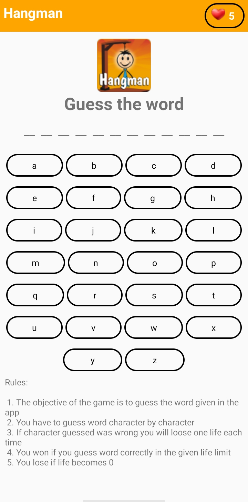

# Hangman(Android Application) 

## Description:-
Hangman is the game which player identifies the hidden word character by character.

### Rules:
1. The objective of the game is to guess the word given in the app
2. You have to guess word character by character
3. If character guessed was wrong you will loose one life each time
4. You won if you guess word correctly in the given life limit
5. You lose if life becomes 0

## App setup:-
1. Download the apk file that i have provided in the repository in your android mobile
2. Open the apk file and click on install 
3. Enjoy the game 

## Screenshots

### *If you want to modify game you can access my files through this locations or just open the folder in android studio*
### Location of java classes:-
app-> src-> main-> java-> com-> example-> hangman

### Location of resources i have used:-
app-> src-> main-> res
**To access all the images and logos i have used from res go to drawable-v24**

### Location of ui or xml files:-
app-> src-> main-> res-> layout

### Location of debug apk:- 
app-> build-> outputs-> apk-> debug

	
